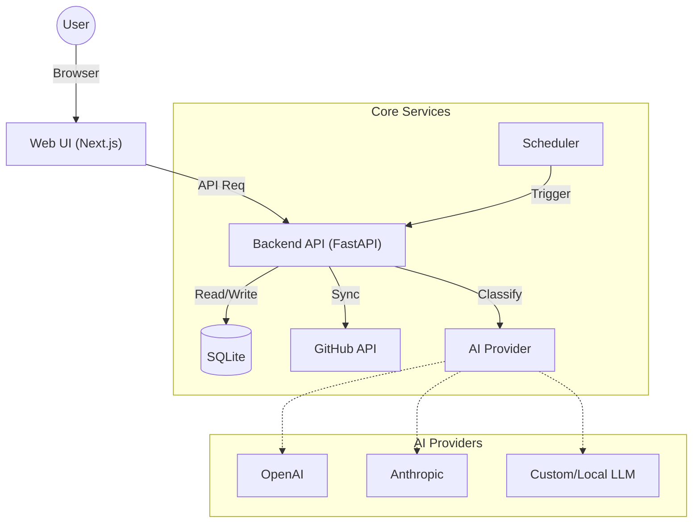

# 🌟 StarSorty

> **不再让你的 GitHub Star 吃灰。**  
> 一个自托管的 GitHub Star 智能管理系统，利用 AI 自动分类、生成摘要，构建你的私人代码知识库。

---

## 目录

- [关于本项目](#-关于本项目)
- [核心功能](#-核心功能)
- [系统架构](#️-系统架构)
- [界面预览](#-界面预览)
- [快速开始](#-快速开始)
- [使用指南](#-使用指南)
- [本地开发](#-本地开发)
- [Roadmap](#-roadmap)
- [License](#-license)

---

## 📖 关于本项目

作为开发者，我们经常会 Star 很多有趣的项目，但随着时间推移，这些 Star 往往变成了一个**巨大、难以检索的“黑洞”**。我们经常遇到这样的情况：“我记得上个月收藏了一个很好用的 Python 爬虫库，叫什么来着？”

**StarSorty** 旨在解决这个问题。它不仅仅是一个同步工具，而是一个**智能化的知识管理管道**。

### 核心工作流

1. **自动同步**：后台静默拉取你的 GitHub Star 数据。
2. **AI 分析**：调用 LLM（OpenAI/Claude/DeepSeek）深度阅读项目的 README。
3. **结构化输出**：自动判断项目分类并打上技术栈标签，生成一句话摘要。
4. **可视化管理**：通过现代化的 Web UI 进行检索和浏览。

---

## ✨ 核心功能

- 🔄 **全自动同步**：内置 Crontab 调度器，定时增量同步，无需人工干预。
- 🤖 **多模型 AI 支持**：
  - 原生支持 OpenAI（GPT-4o 等）与 Anthropic（Claude 3.5）。
  - 完全兼容 OpenAI 格式的第三方模型（DeepSeek、GLM、Moonshot、OneAPI）。
- 🏷️ **标签云系统**：
  - AI 自动生成中文摘要（`summary_zh`）、自由标签（`tags`）和搜索关键词（`keywords`）。
  - 16 个标签分组，覆盖项目类型、运行形态、AI 相关、开发工具等场景。
  - 支持多标签 OR 筛选，快速定位目标项目。
- 🔍 **深度检索**：按语言、标签、用户筛选，支持全文关键词搜索。
- 📝 **人工干预机制**：支持手动覆盖 AI 分类并记录修改历史。
- 🐳 **隐私至上**：Docker 私有化部署，数据完全掌握在自己手中。

---

## 🏗️ 系统架构

StarSorty 采用经典的前后端分离架构，通过 Docker Compose 一键编排。



- **Frontend**: Next.js（SSG + Client Side Fetching），提供极速的静态页面体验。
- **Backend**: FastAPI（Python），处理高并发的同步逻辑和 AI 请求。
- **Database**: SQLite，单文件存储，轻量级，易于备份和迁移。
- **Scheduler**: 内置定时任务系统，确保数据准实时同步。

---

## 🚀 快速开始

推荐使用 Docker 部署，确保已安装 Docker 和 Docker Compose。

### 1. 克隆仓库

```bash
git clone https://github.com/aliom-v/StarSorty.git
cd StarSorty
```

### 2. 配置环境变量

```bash
cp .env.example .env
```

编辑 `.env`，至少配置以下内容：

```env
# --- 基础配置 ---
# 你的 GitHub 用户名
GITHUB_USERNAME=your_name

# GitHub Token (在 Developer Settings -> Personal Access Tokens 申请)
# 只需要 public_repo 权限即可
GITHUB_TOKEN=ghp_xxxxxxxxxxxxxxxxx

# 管理员 Token (用于保护手动触发同步等写操作接口)
ADMIN_TOKEN=your_secure_password

# (可选) GitHub Enterprise 或代理地址
GITHUB_API_BASE_URL=https://api.github.com
```

### 3. 配置 AI 模型（三选一）

> 说明：AI Provider / Model / Base URL / API Key 仅从后端 `.env` 读取，前端不会保存或下发这些敏感配置。

**方案 A: OpenAI**

```env
AI_PROVIDER=openai
AI_API_KEY=sk-xxxx
AI_MODEL=gpt-4o-mini
```

**方案 B: Anthropic (Claude)**

```env
AI_PROVIDER=anthropic
AI_API_KEY=sk-ant-xxxx
AI_MODEL=claude-3-haiku-20240307
```

**方案 C: DeepSeek / 其他兼容模型（推荐国内用户）**

```env
AI_PROVIDER=custom
# 你的 API Base URL (注意结尾通常包含 /v1)
AI_BASE_URL=https://api.deepseek.com/v1
AI_API_KEY=sk-xxxx
AI_MODEL=deepseek-chat
```

### 4. 启动服务

```bash
docker compose up -d
```

启动成功后访问：

- Web 界面: http://localhost:1234
- API 文档: http://localhost:4321/docs

---

## 🛠️ 使用指南

> 提示：Web 页面中的写操作需要 Admin token。请在 Settings 页面输入该 token（仅保存在浏览器本地）。

### 1. 首次数据同步

服务启动后，后台调度器会根据 `CRON_SCHEDULE` 自动运行。若需立即同步：

```bash
curl -X POST "http://localhost:4321/sync" \
  -H "X-Admin-Token: <你设置的ADMIN_TOKEN>"
```

### 2. 触发 AI 分类

同步完成后，触发 AI 分类任务：

```bash
curl -X POST "http://localhost:4321/classify/background" \
  -H "Content-Type: application/json" \
  -H "X-Admin-Token: <你设置的ADMIN_TOKEN>" \
  -d '{"limit": 50, "concurrency": 3}'
```

### 3. 查看状态

```bash
curl "http://localhost:4321/classify/status"
```

---

## 💻 本地开发

### 后端 (Python/FastAPI)

```bash
cd api
python -m venv .venv
# Windows: .venv\Scripts\activate | Mac/Linux: source .venv/bin/activate
pip install -r requirements.txt

# 启动开发服务器
uvicorn app.main:app --reload --port 4321
```

### 前端 (Next.js)

```bash
cd web
npm install

# 启动开发服务器
npm run dev
# 访问 http://localhost:1234
```

---

## 📄 License

本项目采用 MIT License 开源。
